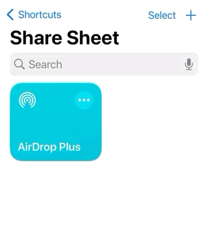
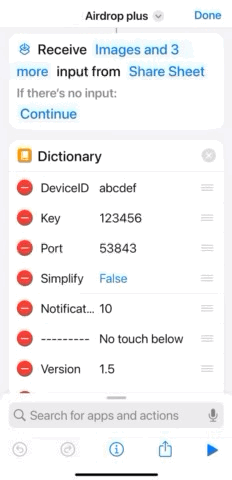
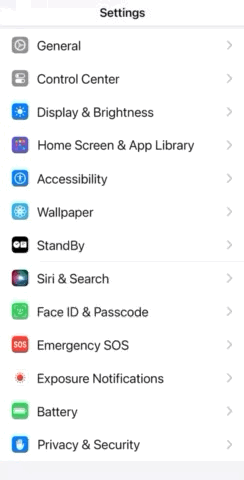

#  AirDrop Plus

<video src="static/demo.mp4" controls muted width="900"></video>

## [中文](README.zh-CN.md)

AirDrop Plus is a Windows tray app + iOS Shortcuts workflow for transferring clipboard text, images, and files between iPhone and Windows over WiFi, bringing an AirDrop-like experience to Windows users.

## Features

- iPhone and Windows PC should be on the same WiFi, or the PC can connect to the iPhone hotspot.
- Provides both portable and installer versions.
- Supports startup on boot.
* Uses an auto-generated 6-character `device_id` (lowercase letters + digits) as the device identifier.
- Supports mDNS host format: `http://<device_id>.local:<port>` (Bonjour is required on Windows).
- Includes a first-run guide (install shortcut by QR, fill device code, startup and save-path setup).
- Bilingual UI (tray menu, guide, settings, and notifications).

## Shortcut Installation

- Link: https://www.icloud.com/shortcuts/87c14547b1de4195b903ce1d18495c2f
- Or scan the QR code below:


## iPhone Usage Guide

### Device Code Setup (`abcdef` is only an example; use the code shown in the guide)



### Run the Shortcut More Conveniently

| Add to Home Screen | Configure Double Back Tap (iPhone 8+) |
| --- | --- |
|  |  |

## Requirements

- Windows 10/11
- Python 3.10+
- Bonjour Print Services for Windows (for `.local` host discovery)

## Run From Source

```powershell
pip install -r requirements.txt
python AirDropPlus.py
```

## Configuration

Edit `config/config.ini` (restart AirDrop Plus after changes):

- `key`: shared secret; must match the iOS shortcut.
- `port`: local HTTP server port.
- `save_path`: folder to save received files (empty means `%USERPROFILE%\Downloads`).
- `device_id`: 6-character device code, generated on first run.
- `auto_start`: launch at startup (`1` or `0`).
- `startup_notify`: show startup notification (`1` or `0`).
- `basic_notifier`: notifier mode (`0` modern / `1` basic).
- `language`: `en` or `zh` (auto-initialized on first run).

## API

### Request Headers

| Name | Type | Description |
| --- | --- | --- |
| `ShortcutVersion` | String | Shortcut version. Major/minor must match app version in `config.ini` (for example, app `1.5.x` expects `1.5`). |
| `Authorization` | String | Secret key. Must exactly match `config.ini` `key`. |

### Send File (iOS -> Windows)

- Method: `POST`
- URL: `/file/send`
- Form fields:

| Name | Type | Description |
| --- | --- | --- |
| `file` | File | File to upload |
| `filename` | String | File name |
| `notify_content` | String | Notification content. For a single file, use the file name; for multiple files, the last request can contain all names separated by line breaks. |

- Response: JSON

### Send File List (iOS -> Windows, pre-notification)

- Method: `POST`
- URL: `/file/send/list`
- Form fields:

| Name | Type | Description |
| --- | --- | --- |
| `file_list` | String | File list separated by `\n` |

- Response: JSON

### Receive File (Windows -> iOS)

- Method: `POST`
- URL: `/file/receive`
- Form fields:

| Name | Type | Description |
| --- | --- | --- |
| `path` | String | File path on Windows to return to iOS |

- Response: file stream

### Send Clipboard (iOS -> Windows)

- Method: `POST`
- URL: `/clipboard/send`
- Body supports:

| Name | Type | Description |
| --- | --- | --- |
| `clipboard` | String | Clipboard text (supports form, JSON, and raw text body) |

- Response: JSON

### Receive Clipboard (Windows -> iOS)

- Method: `GET`
- URL: `/clipboard/receive`
- Response: JSON, where `data.type` can be:

1. `text`
```json
{
  "success": true,
  "msg": "",
  "data": {
    "type": "text",
    "data": "clipboard_text"
  }
}
```

2. `file`
```json
{
  "success": true,
  "msg": "",
  "data": {
    "type": "file",
    "data": ["c:/xx/xx/aa.png", "c:/xx/xx/bb.pdf"]
  }
}
```

3. `img`
```json
{
  "success": true,
  "msg": "",
  "data": {
    "type": "img",
    "data": "img_base64_code"
  }
}
```

## Build

### Package with PyInstaller:

```powershell
powershell -ExecutionPolicy Bypass -File .\scripts\build_exe.ps1 -CleanOutput
```

### Build the exe installer with Bonjour included:

Install Inno Setup into installer\InnoSetup, then run:

```powershell
.\installer\InnoSetup\ISCC.exe .\installer\AirDropPlusInstaller.iss
```

## License

Based on a secondary development of [yeytytytytyytyt](https://gitee.com/yeytytytytyytyt/air-drop-plus)'s project

MIT License. See `LICENSE`.

## Star Trend

[](https://starchart.cc/Ilikectrlmusic/Airdrop-Plus)
