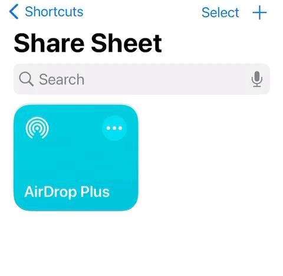

#  AirDrop Plus

<video src="static/demo.mp4" controls muted width="900"></video>

## [English](README.md)

AirDrop Plus 是一个 Windows 托盘程序 + iOS 快捷指令方案，用于在 iPhone 与 Windows 之间通过 WiFi 传输剪贴板文本、图片和文件，让 Windows 用户也能获得类似 AirDrop 的体验。

## 功能特点

- 手机和电脑需要连接同一 WiFi，或电脑连接手机热点。
- 提供便携版和安装版。
- 支持开机自启动。
- 使用自动生成的 6 位 `device_id`（小写字母 + 数字）作为设备识别码。
- 支持 mDNS 地址：`http://<device_id>.local:<port>`（Windows 端需要 Bonjour）。
- 首次运行提供引导页（扫码安装、填写设备码、开机自启动和保存路径设置）。
- 支持中英文界面（托盘菜单、引导页、设置页、通知）。

## 快捷指令安装

- 链接：https://www.icloud.com/shortcuts/e3b3e7d39ee84a49892f8de547a943f2
- 或扫描下方二维码：


## 手机端使用教程

### 设备码设置（`123456` 只是示例，请填写引导页显示的设备码）



### 便捷地运行快捷指令

| 添加到主屏幕 | 设置双击背面运行（iPhone 8+） |
| --- | --- |
|  |  |

## 运行环境

- Windows 10/11
- Python 3.10+
- Bonjour Print Services for Windows（用于 `.local` 主机名发现）

## 源码运行

```powershell
pip install -r requirements.txt
python AirDropPlus.py
```

## 配置说明

编辑 `config/config.ini`（修改后需重启 AirDrop Plus 生效）：

- `key`：与快捷指令一致的密钥。
- `port`：本地 HTTP 服务端口。
- `save_path`：接收文件保存目录（留空为 `%USERPROFILE%\Downloads`）。
- `device_id`：6 位设备码，首次运行自动生成。
- `auto_start`：开机启动（`1` 或 `0`）。
- `startup_notify`：是否显示启动通知（`1` 或 `0`）。
- `basic_notifier`：通知实现切换（`0` 现代通知 / `1` 基础通知）。
- `language`：`zh` 或 `en`（首次运行自动初始化）。

## API

### 请求头参数

| 参数名 | 类型 | 描述 |
| --- | --- | --- |
| `ShortcutVersion` | String | 快捷指令版本。主次版本号需要与 `config.ini` 中的程序版本一致（例如程序为 `1.5.x`，快捷指令应传 `1.5`）。 |
| `Authorization` | String | 密钥，需要与 `config.ini` 中 `key` 完全一致。 |

### 文件发送（iOS -> Windows）

- 方法：`POST`
- URL：`/file/send`
- 表单参数：

| 参数名 | 类型 | 描述 |
| --- | --- | --- |
| `file` | File | 要发送的文件 |
| `filename` | String | 文件名 |
| `notify_content` | String | 通知显示内容。单文件时可直接为文件名；多文件时可在最后一个请求中传入全部文件名（换行分隔）。 |

- 返回：JSON

### 文件发送列表（iOS -> Windows，预通知）

- 方法：`POST`
- URL：`/file/send/list`
- 表单参数：

| 参数名 | 类型 | 描述 |
| --- | --- | --- |
| `file_list` | String | 文件列表，文件名之间用 `\n` 分隔 |

- 返回：JSON

### 文件接收（Windows -> iOS）

- 方法：`POST`
- URL：`/file/receive`
- 表单参数：

| 参数名 | 类型 | 描述 |
| --- | --- | --- |
| `path` | String | 要读取并返回给手机的文件路径 |

- 返回：文件流

### 剪贴板发送（iOS -> Windows）

- 方法：`POST`
- URL：`/clipboard/send`
- 请求体支持：

| 参数名 | 类型 | 描述 |
| --- | --- | --- |
| `clipboard` | String | 剪贴板文本（支持表单、JSON、纯文本 body） |

- 返回：JSON

### 剪贴板接收（Windows -> iOS）

- 方法：`GET`
- URL：`/clipboard/receive`
- 返回：JSON，`data.type` 可能为：

1. `text`
```json
{
  "success": true,
  "msg": "",
  "data": {
    "type": "text",
    "data": "clipboard_text"
  }
}
```

2. `file`
```json
{
  "success": true,
  "msg": "",
  "data": {
    "type": "file",
    "data": ["c:/xx/xx/aa.png", "c:/xx/xx/bb.pdf"]
  }
}
```

3. `img`
```json
{
  "success": true,
  "msg": "",
  "data": {
    "type": "img",
    "data": "img_base64_code"
  }
}
```

## 打包说明

### 使用 PyInstaller 打包：

```powershell
powershell -ExecutionPolicy Bypass -File .\scripts\build_exe.ps1 -CleanOutput
```

### 构建含 bonjour 的 exe安装包：

把 inno setup 安装到 installer\InnoSetup 中，然后运行：

```powershell
.\installer\InnoSetup\ISCC.exe .\installer\AirDropPlusInstaller.iss
```

## 许可证

基于 [yeytytytytyytyt](https://gitee.com/yeytytytytyytyt/air-drop-plus) 的项目二次开发：  

许可证使用 MIT，见 `LICENSE`。

## Star 趋势

[](https://starchart.cc/Ilikectrlmusic/Airdrop-Plus)
